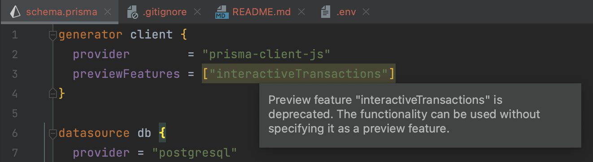

### Prisma ORM plugin issue reproduction

The [Prisma ORM](https://plugins.jetbrains.com/plugin/20686-prisma-orm) plugin version 231.8109.91 incorrectly flags `"interactiveTransactions"` as a non-preview feature while using the node packages `prisma` and `@prisma/client` at version `^3.15.1`.

This project is a minimal reproduction of the issue. Open the project in WebStorm (with the Prisma ORM plugin v231.8109.91 installed) and navigate to the [schema.prisma](prisma/schema.prisma) file. Hover your cursor over the highlighted `"interactiveTransactions"` text, and you should see the following warning



Run the following commands to verify that this error message does not show up when validating with the appropriate version of the Prisma CLI

```shell
yarn install
yarn prisma:validate
```

> **Note**: Tested in WebStorm 2023.1 Build #WS-231.8109.174
